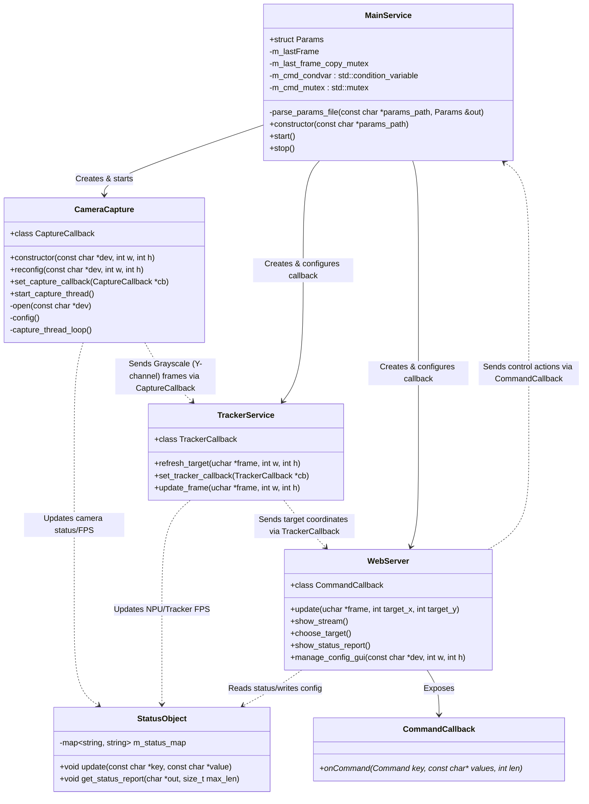
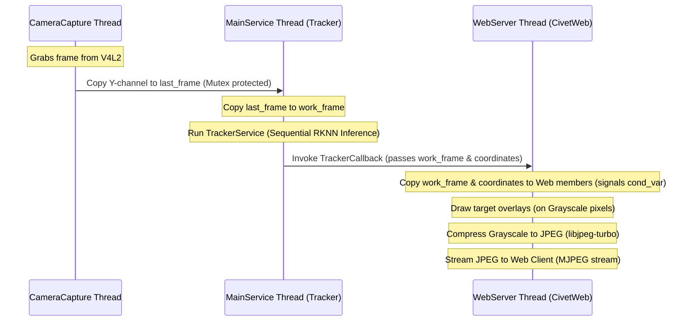

# First Demo - Real-Time Target Tracker

This repository contains the implementation of a real-time target tracking demo application designed to run on the **Radxa Zero 3E** platform (powered by the Rockchip RK3566 SoC).

The application captures video frames from a USB camera (UVC V4L), processes them using Rockchip's RKNN NPU for target tracking, and serves a live video stream (with tracking overlays) and a control GUI via a lightweight embedded web server.

---

## 🎯 Motivation & Objectives

1. **Embedded NPU Utilization**: Showcase real-time object tracking utilizing the Rockchip RKNN SDK on the Radxa Zero 3E NPU.
2. **Low Latency & High Performance**: Maximize frames-per-second (FPS) and minimize latency through a lightweight multi-threaded C++ architecture tailored for embedded systems.
3. **Web-Based Control & Monitoring**: Provide a responsive web interface to stream video, configure parameters dynamically, and monitor hardware statistics in real time.
4. **Embedded Quality ("Production-Grade")**: Maintain strict memory boundaries, avoid unnecessary heap allocations, and implement robust error-handling for hardware connectivity (e.g., camera disconnection).

---

## 📐 Architecture & UML Diagram

The system is designed with a modular architecture centered around a main orchestrator service (`MainService`), coordinating specialized worker modules.



### Component Breakdown

*   **`MainService`**: The central orchestrator. It instantiates the components, links their callbacks, and manages the lifecycle of the system.
    *   **Synchronization**: Utilizes `std::condition_variable` and a `std::mutex` to wait for reconfiguration requests or commands issued asynchronously by the Web Server threads. When a command (e.g. `UPDATE_CAMERA_PARAMS` or `SAVE_PARAMS`) is received, the main thread is woken up to safely reconfigure components.
    *   **Pre-allocated Memory**: Allocates the shared grayscale image buffers (up to 1920x1280 bytes) at startup.
*   **`CameraCapture`**: Runs in a dedicated background thread to manage the camera via V4L2.
    *   **Grayscale Capture**: Configures the camera to capture in a high-quality YUV format (YUV420 or YUV422) but extracts and returns **only the Y (grayscale/luminance) channel** via `CaptureCallback::onFrame` (1 byte per pixel).
    *   **Auto-Reconnection**: Includes an auto-reconnection loop. If the device node disappears or fails, it sleeps for `30ms` and retries, dynamically acquiring updated `/dev/videoX` paths if reconfigured.
*   **`TrackerService`**: Handles RKNN inference for object tracking.
    *   **Efficiency**: Processes the grayscale frame sequentially on the `MainService` thread (matching the RKNN input requirement of a single channel, minimizing memory transfer and latency).
    *   **Callbacks**: Fires `TrackerCallback::onTargetDetected` when a target's coordinates are localized.
*   **`WebServer`**: An embedded HTTP/WebSocket server (CivetWeb) hosting the live stream and control GUI.
    *   **Grayscale JPEG Compression**: Grabs the processed gray frame, compresses it to JPEG (which is extremely fast for a single channel), and streams it using a multipart MJPEG response.
    *   **GUI & Status Refresh**: Periodically queries the system status. When requesting the status report, it triggers real-time checking of `/dev/video*`, CPU, and memory stats.
    *   **Generic Command Callback**: Implements the generic `CommandCallback::onCommand(Command key, const char* values, int len)` to pass control strings (e.g., `"/dev/video1#800#600"` for camera updates) back to `MainService`.
*   **`StatusObject` (Singleton)**: A globally accessible status registry.
    *   **On-Demand Telemetry**: To avoid active polling overhead, calls to `get_status_report(char *out, size_t max_len)` will dynamically search for active `/dev/video*` nodes, read CPU and memory usage (from `/proc/stat` and `/proc/meminfo`), format them into a newline-separated (`\n`) text buffer, and return it.

---

## 🛠️ Technology Stack & Web Solution

### Build System
The project is built using **CMake**, facilitating cross-compilation for target embedded environments (using Poky/Yocto toolchains).

### Web Server: CivetWeb
We utilize **CivetWeb** (MIT Licensed, C-based HTTP/WebSocket server library) for the `WebServer` component.
*   **Minimal Footprint**: Written in pure C, compiled statically into the application, consuming negligible RAM and CPU.
*   **Native MJPEG Streaming**: Easily handles chunked multipart HTTP responses, letting us stream raw processed video frames to standard web browsers without client-side plugins.
*   **Control API**: Handles HTTP REST requests (e.g., GET `/status`, POST `/config`) to interface seamlessly with the C/C++ backend.
*   **Yocto & CMake Compatibility**: Easily packaged inside Yocto (`meta-ksg`) and integrated into the CMake build tree.

---

## 📝 Code Style & Guidelines

To ensure performance, safety, and readability in a resource-constrained embedded environment, the following strict coding guidelines must be adhered to:

### 1. Dialect & STL Limitations
*   **OOP Structure**: Use C++ classes (`class`, `struct`) for encapsulation and modularity.
*   **No General STL**: Avoid `std::vector`, `std::string`, `std::list`, `std::unique_ptr`, `std::shared_ptr`, `auto`, and iterators.
*   **Allowed STL Exceptions**:
    *   Thread management: `std::thread`, `std::mutex`, `std::lock_guard`, `std::condition_variable`.
    *   `StatusObject` internal telemetry storage: `std::map<std::string, std::string>` and `std::string` keys/values.
    *   Optional exceptions for the configuration file parser (`params.conf`).

### 2. Variable Declarations
*   Declare all variables at the **beginning of their enclosing block** (immediately after the opening brace `{`), rather than inline or scattered throughout the scope.
*   *Exception*: Loop counters declared directly in `for` statements (e.g., `for (int i = 0; ...)`) are allowed.

### 3. Formatting & Braces (Allman/BSD Style)
*   Sgroud/bracket placement must start on a **new line** for all blocks (functions, classes, control structures).
*   Keywords like `else`, `while`, `catch` must also start on a new line.

*Correct Example:*
```cpp
if (condition)
{
    int tempValue = 0;
    // ...
}
else
{
    // ...
}
```

*Incorrect Example:*
```cpp
if (condition) {
    // ...
} else {
    // ...
}
```

### 4. Includes & standard libraries
*   Use standard C headers with the `.h` extension (e.g., `#include <stdio.h>`, `#include <stdlib.h>`, `#include <string.h>`), rather than C++ wrappers (like `<cstdio>`), except for the allowed C++ STL exceptions.

### 5. Logging & Prints
*   Use `fprintf` to `stdout` or `stderr` for logging and print statements. Do not use `std::cout` or `std::cerr`.
*   Example: `fprintf(stdout, "[CameraCapture] Thread started.\n");`

---

## 🔄 Detailed Data Flow & Threading Model

To ensure optimal performance and prevent blocking the time-critical camera and inference loops, the application strictly isolates camera capture, tracking, and web streaming tasks across three distinct thread boundaries:

### 1. The Video Pipeline Step-by-Step



1.  **Camera Thread (`CameraCapture`)**:
    *   Grabs a raw YUV frame from the hardware device via V4L2.
    *   Extracts the **Y (grayscale/luminance) channel** only.
    *   Copies this grayscale frame to `last_frame` in `MainService` under mutex protection.
    *   Cycles immediately to capture the next frame without waiting for processing or compression.
2.  **Main Thread (`MainService` / `TrackerService`)**:
    *   Copies the latest `last_frame` into its local `work_frame` to release the mutex immediately.
    *   Executes the target tracking logic sequentially (RKNN NPU inference).
    *   Upon completion, invokes `TrackerCallback` with the processed `work_frame` and the newly calculated target coordinates.
3.  **Web Server Thread (`WebServer` / CivetWeb)**:
    *   The callback copies the `work_frame` and coordinates into the web server's internal buffers and signals the streaming thread using a `std::condition_variable`.
    *   The streaming thread wakes up, draws the target tracking bounding boxes directly onto the grayscale pixels in memory, compresses the final image to JPEG using `libjpeg-turbo`, and sends it to the connected client.

### 2. Client Interaction & Bounding Box Selection
*   **Coordinate System**: All coordinates sent between the Web Browser client and the server are **normalized (from 0.0 to 1.0)**.
*   **Target Selection Event**: When a user clicks on the MJPEG stream window in their browser, client-side JavaScript detects the click, calculates the relative `(x, y)` coordinate relative to the display window, and sends an HTTP request (e.g. `/api/choose_target?x=0.5&y=0.4`) to CivetWeb.
*   **Command Route**: CivetWeb handles the request and invokes `CommandCallback::onCommand(CHOOSE_TARGET, values, len)`. This queues the command or triggers a condition variable to notify the main thread to safely update the tracker's initialization target.

### 3. NPU Error Fallback & Stability
*   If the `.rknn` model is missing, corrupt, or fails to initialize on the Radxa Zero 3E NPU, the application **must not crash**.
*   The NPU initialization failure is written to `StatusObject` to be displayed in the web UI status report.
*   The tracker functions (like `update_frame` and `refresh_target`) will gracefully return a failure code on every call, and the application will continue running in "camera-only" mode, allowing the user to troubleshoot via SSH or configuration updates.

### 4. Single-Client Streaming Limitation
*   To conserve CPU and memory bandwidth on the embedded Radxa board, the web server only supports **a single active video stream** at a time.
*   Subsequent client requests to view the MJPEG stream while another is active are automatically rejected with a `503 Service Unavailable` or `409 Conflict` HTTP response.

### 5. Signal Handling & Resiliency (SIGINT / Ctrl+C)
*   **SIGINT Handling**: A standard C signal handler is registered for `SIGINT` (Ctrl+C). This is critical during development when hot-reloading binaries via `scp` or terminal execution.
*   **Graceful Exit**: Upon receiving `SIGINT` or `SIGTERM`, the handler sets `mainServiceIsAlive = false` and signals the condition variables. This ensures all background threads (`CameraCapture`, `WebServer`) exit their execution loops, join the main thread, and release resources (such as V4L2 device nodes and RKNN context) cleanly.
*   **Crash Prevention Concept**: The application is designed to tolerate hardware and software configuration errors (camera disconnection, model loading failure) without crashing. Detailed status reports of any subsystem failure are stored in `StatusObject` and served to the user via the Web Server, allowing full diagnostics without losing connection.

### 6. Tracker Preprocessing & Heatmap Decoding
To match the training and verification pipeline in `training/tracker/tracker_ver4/` (specifically `keras_visualization_test.py`), the tracker service implements the following exact image preprocessing and output decoding rules:

*   **Image Preprocessing & Resizing**:
    *   **Search Region**: The grayscale search frame is resized to `256x256` using **Bilinear Interpolation** (equivalent to `cv2.INTER_LINEAR`).
    *   **Reference / Template**: The target template stack layer is resized to `32x32` or `256x256` (visualization) using **Nearest-Neighbor Interpolation** (equivalent to `cv2.INTER_NEAREST`).
    *   Values are normalized from `[0, 255]` to `[0.0, 1.0]` (divided by `255.0` as float32) before being fed to the NPU.
*   **Output Heatmap Decoding**:
    1.  **Threshold Gate (Noise Filter)**: Apply a threshold of `0.5`. All pixels in the output `256x256` heatmap below `0.5` are set to `0.0`.
    2.  **Connected Component (Blob Size) Filter**: Analyze the thresholded heatmap using an 8-connectivity Breadth-First Search (BFS). If a connected component (blob) of active pixels contains fewer than **30 pixels**, all pixels in that blob are set to `0.0`.
    3.  **Local Centroid Refinement**:
        *   Locate the coordinates `(y_max, x_max)` of the absolute peak value in the filtered heatmap.
        *   Define a local `5x5` window (radius of 2 pixels) centered at `(y_max, x_max)` (bounded by image dimensions).
        *   Calculate the Center of Mass (Weighted Centroid) within this local window:
            $$\text{Total Mass} = \sum_{(y,x) \in 5 \times 5} \text{Heatmap}[y][x]$$
            $$x_c = \frac{\sum x \cdot \text{Heatmap}[y][x]}{\text{Total Mass}}, \quad y_c = \frac{\sum y \cdot \text{Heatmap}[y][x]}{\text{Total Mass}}$$
        *   If the total mass is smaller than `1e-6`, fall back to the absolute peak coordinates `(x_max, y_max)`.
        *   Normalize the final coordinates to `[0.0, 1.0]` by dividing by `256.0`.

### 7. Parameter Saving (`SAVE_PARAMS`)
*   When the `WebServer` triggers the `SAVE_PARAMS` command, `MainService` writes the current configuration values directly to `params.conf`.
*   For the scope of this demo, a simple file overwrite (`fopen` with `"w"`) is used to write configuration keys and values, keeping the I/O implementation simple and lightweight.


