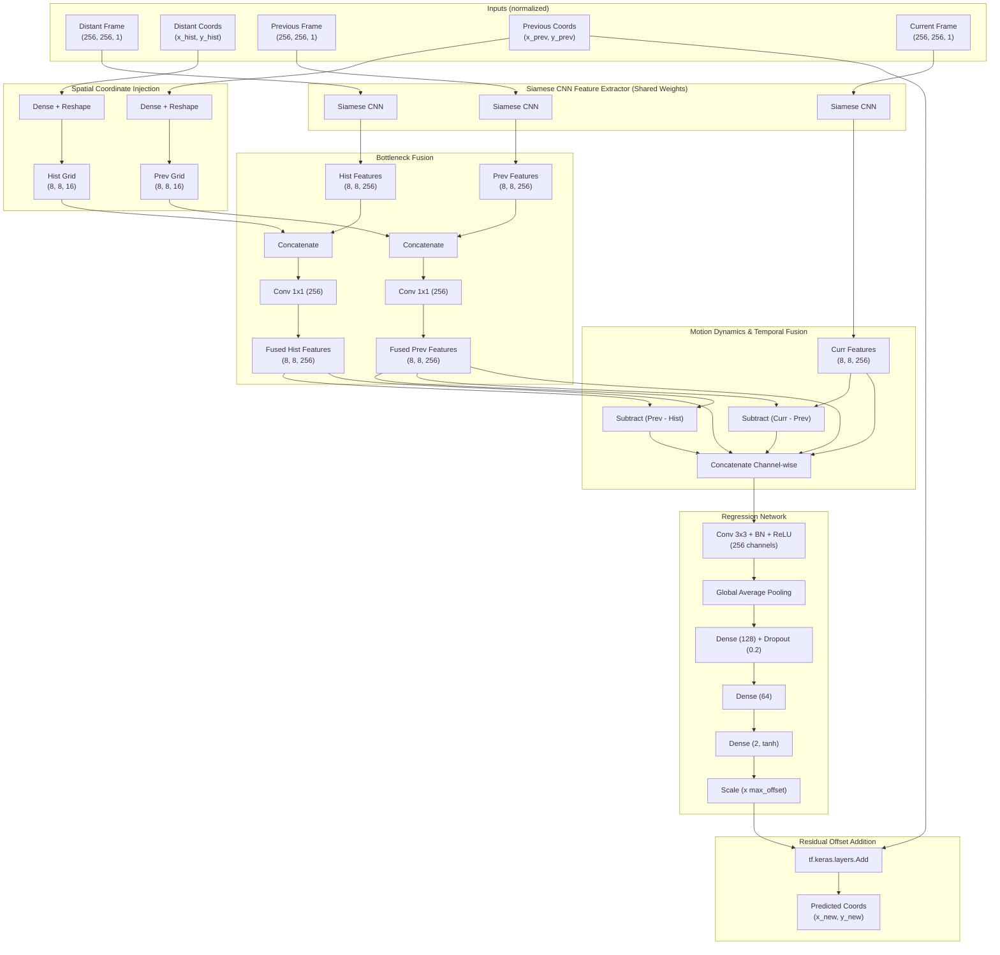

# Recursive Geometric Target Tracker (Keras)

A high-performance, deep-learning-based recursive target tracking system implemented in Keras and Python. This model is specifically engineered to track a target object across video sequences by exploiting temporal motion dynamics and historical context. It is designed to be highly stable when running recursively while remaining highly resilient to geometric transformations (such as scaling, rotations, and perspective warping).

---

## 📐 Architecture Design

The tracker processes three temporal frames alongside two historical coordinate inputs, extracting deep features via a shared Siamese network, injecting coordinates at feature bottlenecks, and regressing local target displacement.



---

## 🛠️ Key Architectural Paradigms

### 1. Siamese Feature Extraction
Frames separated in time share a single convolutional neural network. This forces the model to learn invariant descriptors of the target's physical appearance (e.g. textures, boundaries, local geometry) rather than temporal-specific noise, boosting tracking robustness.

### 2. Dual Spatial Coordinate Injection
Standard CNNs are translation-invariant and cannot easily associate raw scalar numbers like coordinates `[x, y]` with high-dimensional feature grids. To solve this:
* Scalar `[x, y]` coordinates are projected to a higher-dimensional space ($8 \times 8 \times 16$) using a Dense layer.
* These spatial coordinate grids are concatenated with the convolutional features extracted from the corresponding frames.
* A $1 \times 1$ convolution blends visual features with spatial location priors, enabling the CNN to remain translation-aware.

### 3. Temporal Motion & Geometric Warping Fusion
The network explicitly models motion displacement across two temporal steps:
$$\mathbf{M}_{\text{hist}\to\text{prev}} = \mathbf{F}_{\text{prev\_fused}} - \mathbf{F}_{\text{hist\_fused}}$$
$$\mathbf{M}_{\text{prev}\to\text{curr}} = \mathbf{F}_{\text{curr}} - \mathbf{F}_{\text{prev\_fused}}$$

By combining these displacement matrices with the visual appearances, the model captures the velocity, acceleration, and scaling trends of the target object. This provides resilience to geometric warping such as aspect ratio shifts or rotation.

### 4. Residual (Offset) Regression for Stability
To eliminate tracking drift, the network performs **local neighborhood regression**:
* Rather than predicting raw coordinates over the entire $256 \times 256$ workspace, the model predicts the relative offset vector $(\Delta x, \Delta y)$ from the immediate previous known location $\mathbf{C}_{\text{prev}}$.
* The output is squashed using a `tanh` activation to $[-1, 1]$ and scaled by a configurable `max_offset` constraint (e.g., $0.2$, representing $20\%$ of the image dimension):
$$\mathbf{C}_{\text{new}} = \mathbf{C}_{\text{prev}} + \text{max\_offset} \cdot \tanh(\mathbf{z})$$
* This limits the search window, filters out extreme outlying predictions, and ensures strong numerical convergence when run recursively.

---

## 📂 File Structure

* **`tracker/__init__.py`**: Exposes the main model class.
* **`tracker/model.py`**: Implementation of `TargetTracker`, custom epoch training steps, and loop logic.
* **`test_tracker.py`**: An automated, self-contained verification test suite to check model construction, shapes, forward pass, and backpropagation gradients.
* **`test_generator.py`**: An automated unit test verifying directory scanning, image cropping, OpenCV affine warping, coordinate translation, and pickle serialization.

---

## 📘 API Reference

### `TargetTracker`

#### `__init__(input_shape=(256, 256, 1), max_offset=0.2)`
Initializes the target tracker.
* `input_shape`: Dimension of the input video frames (Height, Width, Channels). Default is `(256, 256, 1)`.
* `max_offset`: Maximum fractional displacement step allowed per frame. Default is `0.2` (max $51.2$ pixels movement per step).

#### `create_model()`
Constructs the Keras functional model graph.
* **Inputs**:
  1. `hist_frame`: `(batch_size, 256, 256, 1)`
  2. `hist_coords`: `(batch_size, 2)`
  3. `prev_frame`: `(batch_size, 256, 256, 1)`
  4. `prev_coords`: `(batch_size, 2)`
  5. `curr_frame`: `(batch_size, 256, 256, 1)`
* **Outputs**:
  * `new_coords`: `(batch_size, 2)` representing predicted `[x, y]` coordinates.

#### `train_epoch(dataset, optimizer, loss_fn)`
Trains the tracker model for one full epoch using a custom `tf.GradientTape` loop.
* `dataset`: A `tf.data.Dataset` yielding:
  `((hist_frames, hist_coords, prev_frames, prev_coords, curr_frames), target_coords)`
* `optimizer`: `tf.keras.optimizers.Optimizer` instance.
* `loss_fn`: `tf.keras.losses.Loss` instance.
* **Returns**: Average training loss (MSE) for the epoch.

#### `train(dataset, lr, num_of_epochs, validation_data=None)`
Runs the complete training process, alternating between running `train_epoch()` and `evaluate()`.
* `dataset`: The training dataset.
* `lr`: Learning rate for the Adam optimizer.
* `num_of_epochs`: Number of epochs to train.
* `validation_data`: Optional validation dataset to evaluate against.

#### `TargetTracker.generate_dataset(images_path, output_path, batch_size=256, num_of_samples=16384)`
*(Static Method)* Synthetically generates a high-quality recursive tracking dataset from a directory of raw images or a text file listing images.
* **Parameters**:
  - `images_path` (str): Path to a directory containing raw images OR path to a `.txt` file containing absolute/relative image paths (one per line). Grayscale images with extensions `.jpg`, `.jpeg`, `.png` are supported.
  - `output_path` (str): Folder where numbered pickle batches are saved (`dataset_0.pkl`, `dataset_1.pkl`, ...).
  - `batch_size` (int): Number of sequences packed into each pickle file. Default is `256`.
  - `num_of_samples` (int): Desired total sample size. Auto-rounded up to the nearest multiple of `batch_size`. Default is `16384`.
* **Sample Structure**:
  - **Distant Frame ($W_{hist}$)**: Resized $256 \times 256$ crop representing a larger zoom window. Distorted via a random $2\text{D}$ affine warp to simulate perspective parallax.
  - **Distant Coords ($[x, y]$)**: Target position normalized in $W_{hist}$, mathematically transformed by the same affine warping matrix.
  - **Previous Frame ($W_{prev}$)**: Resized $256 \times 256$ crop representing a medium zoom window (closer). Distorted via a separate random affine warp.
  - **Previous Coords ($[x, y]$)**: Target position normalized in $W_{prev}$ and transformed by the affine matrix.
  - **Current Frame ($W_{curr}$)**: Resized $256 \times 256$ crop representing a smaller zoom window (even closer), simulating forward progress. Not warped.
  - **Target Coords ($[x, y]$)**: Target position normalized in $W_{curr}$, serving as the ground-truth regression target.
* **Camera Drift Simulation**: Small random offsets are injected into the center of each crop window to simulate camera panning. Target coordinates are dynamically shifted relative to these offsets to ensure $100\%$ labeling accuracy.

#### `evaluate(dataset)`
*(TODO Placeholder)* Evaluates the model on validation data. Recommend measuring Euclidean **Center Location Error (CLE)** and tracking success rates over long sequences (recursive drift evaluation).

---

## 🚀 How to Run Verification

The verification script runs fully inside your dedicated Docker environment. It builds the model, verifies functional paths, tests shape compliance, and trains on a small dummy dataset.

Navigate to the `smart_rahfan` project directory and run:

```bash
cd /home/elazarkin/work/deeplearning/home/work/projects/ksg/smart_rahfan
PYTHONPATH=training python3 training/test_tracker.py
```

### 📊 How to Run Dataset Generator Verification

To run the automated dataset generator test suite (which sets up dummy images, runs the pipeline, verifies data shapes, checks coordinate bounds, and performs complete directory cleanups):

```bash
PYTHONPATH=training python3 training/test_generator.py
```

### 🖼️ How to Run Visual Dataset Inspector (GUI)

To visually inspect the synthetically generated frames (Distant, Previous, and Current) with their target labels in a graphical dark-mode Tkinter interface, run:

```bash
python3 training/tracker/dataset_visual_test.py --images_path /path/to/your/images_or_txt_file
```

* **Controls**:
  - **`Space`**: Dynamically generates the next single-sample tracking sequence (`batch_size=1`) and displays it.
  - **`Escape`**: Closes the application and cleans up temporary visual test files.

---

### 🖥️ How to Run Dataset Generator directly via CLI

You can execute the generator directly from the command line by running `model.py` with the `generate_dataset` subcommand:

```bash
python3 training/tracker/model.py generate_dataset \
    --images_path /path/to/your/images_or_txt_file \
    --output_path /path/to/save/pickles \
    --batch_size 256 \
    --num_of_samples 16384
```

* **Flags**:
  - `--images_path`: Path to a directory containing images or a `.txt` file containing image file paths (one per line).
  - `--output_path`: Folder where the numbered pickle batches (`dataset_0.pkl`, `dataset_1.pkl`, ...) will be saved.
  - `--batch_size`: Batch size per pickle file. Optional (default: `256`).
  - `--num_of_samples`: Total number of synthetic samples to generate. Optional (default: `16384`).

---

### 🏋️ How to Run Target Tracker Model Training via CLI

You can train the model directly using `model.py` with the `train` subcommand, specifying the dataset, learning rate, loss function, validation splitting, model resuming, and output checkpointing:

```bash
python3 training/tracker/model.py train \
    --dataset_dir /path/to/pickles \
    --lr 0.001 \
    --num_of_epochs 10 \
    --loss logcosh \
    --eval_pkl_num 4 \
    --init_keras_file /path/to/resume_model.keras \
    --output /path/to/save_best_model.keras
```

* **Flags**:
  - `--dataset_dir` (required): Directory containing the numbered `.pkl` batches (`dataset_0.pkl` ...).
  - `--lr`: Learning rate for Adam optimizer. Optional (default: `1e-3`).
  - `--num_of_epochs`: Number of training epochs. Optional (default: `10`).
  - `--loss`: The loss function to optimize. Choices are:
    - `logcosh` (default): Smooth L1 approximation, extremely stable.
    - `wing`: Custom Wing Loss for highly precise pixel-level keypoint regression.
    - `huber`: Smooth L1 loss with `delta=1.0`.
    - `mse`: Standard Mean Squared Error (L2 loss).
  - `--eval_pkl_num`: Number of initial pickle files (e.g., `0` to `eval_pkl_num-1`) allocated for evaluation/validation. The remaining pickles are used for training. Optional (default: `4`).
  - `--init_keras_file`: Path to an existing `.keras` model file to load and resume training from. If it doesn't exist or is not specified, a new model is built. Optional.
  - `--output`: Path where the best trained Keras model will be saved. If not specified, saves the model automatically as `tracker_model_score_{best_score:.4f}.keras` in the current folder when a score improvement occurs. Optional.

#### 📈 Score-Based Checkpointing & Saving
Before starting the training loop, the script samples the initial model performance on the validation pickles, establishing a baseline `best_score` calculated as:
$$\text{score} = \frac{1}{\text{validation\_loss} + 10^{-7}}$$

At the end of each epoch, the model evaluates itself on the validation pickles. If the current `epoch_score > best_score`, the model is saved to `--output` (or the score-stamped filename), and `best_score` is updated.
