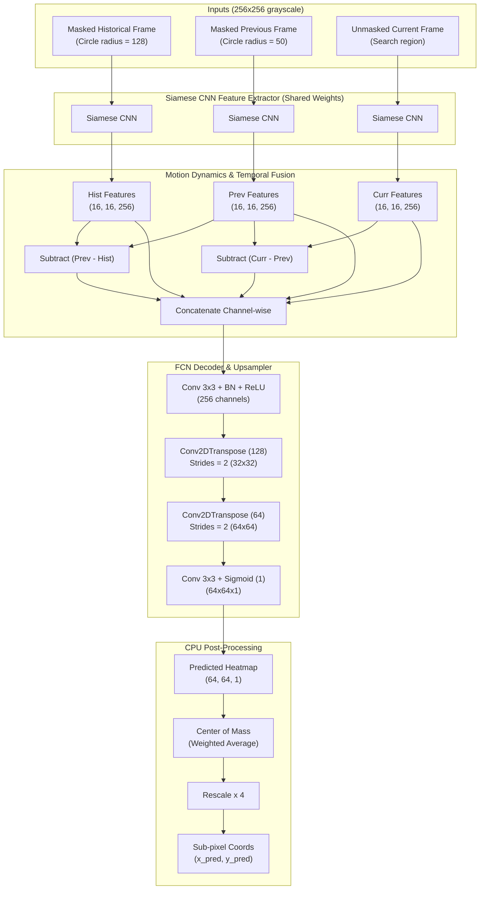

# Fully Convolutional Target Tracker with Attention Masking & Heatmaps (TargetTracker2)

This directory contains the second-generation **Fully Convolutional Network (FCN) Siamese Tracker** (`tracker_model2.py`). 

By shifting from direct coordinate regression (Dense layers) to **spatial probability mapping (Gaussian Heatmaps)** and **Circular Attention Masking**, this model completely preserves spatial coordinates throughout the network, maximizing tracking precision (sub-pixel resolution via CPU-based Center of Mass) while being highly optimized for Edge NPUs (like the Rockchip RK3566 on the Radxa Zero 3E).

---

## 📐 Architecture Design

The FCN tracker accepts three temporal frame inputs—without any coordinate numbers or Dense bottleneck projections. It extracts features via a shared Siamese CNN, temporal-fuses them, and decodes them to a single spatial probability heatmap.



---

## 🛠️ Key Architectural Paradigms

### 1. Siamese Feature Extraction
All three frames are passed through a single, shared convolutional backbone. This ensures the model learns frame-invariant descriptors of the target's physical appearance.

### 2. Circular Attention Masking (Inputs)
Instead of feeding continuous coordinates $[x, y]$ to Dense layers, the tracker's previous locations are converted directly into visual attention masks:
* **Historical Frame**: A binary circular mask of **radius = 128 pixels** is applied around the warped target point. This provides global contextual cues.
* **Previous Frame**: A circular mask of **radius = 50 pixels** is applied around the warped previous target. This restricts focus to the immediate neighborhood, simulating local search.
* **Current Frame**: Fed into the model completely unmasked, serving as the search area.
* **Warp-Before-Mask Rule**: During dataset generation, the random 2D affine warps and orientation rotations are applied *before* masking. The circular mask is then mathematically centered around the *newly warped* target coordinates, simulating accurate camera panning and perspective distortions.

### 3. 2D Gaussian Heatmap (Target Labels)
To avoid the binary step-function limitations of solid circular targets (which suffer from flat gradients and fail to guide near-miss predictions), the target is represented as a smooth **2D Gaussian Heatmap** on a $64 \times 64$ grid with $\sigma = 4.0$:
$$\mathbf{H}(x, y) = \exp\left( -\frac{(x - x_0)^2 + (y - y_0)^2}{2\sigma^2} \right)$$
The peak equals $1.0$ at the exact target location and smoothly decays to $0.0$. This provides a rich, continuous gradient landscape, forcing the model to converge extremely fast and remain stable.

### 4. CPU-based Center of Mass (Sub-pixel Precision)
Once the FCN outputs the $64 \times 64 \times 1$ probability heatmap, the sub-pixel coordinates are calculated outside the model using a weighted center of mass:
$$\bar{x} = \frac{\sum_{i,j} i \cdot \mathbf{H}_{i,j}}{\sum_{i,j} \mathbf{H}_{i,j}}, \quad \bar{y} = \frac{\sum_{i,j} j \cdot \mathbf{H}_{i,j}}{\sum_{i,j} \mathbf{H}_{i,j}}$$
A small threshold (e.g. `0.1`) is applied to filter out background noise. Since this is a simple weighted average, it takes less than `0.1ms` on a standard CPU while delivering sub-pixel precision.

### 5. 100% NPU Hardware Optimization
Since the FCN network consists exclusively of standard convolutions, batch normalizations, and transpose convolutions, it is **100% compatible with Edge NPUs** (such as the Rockchip RK3566 NPU). Dynamic geometric warps or indexing layers (which NPUs struggle to accelerate) are completely avoided.

---

## 📂 File Structure

* **`tracker/tracker_model2.py`**: Implementation of FCN model, custom heatmap/masking helpers, prefetch dataset generator, and clean training loops.
* **`tracker/keras_visualization_test2.py`**: Interactive Tkinter visual inspector displaying 4 horizontal panels (Historical, Previous, Ground Truth Heatmap, and Neon Green Prediction).
* **`tracker/run_examples.txt`**: Execution command snippets for training and inference.

---

## 🏋️ Advanced Loss Functions

The model supports multiple state-of-the-art spatial loss functions:
1. **`mse`** (Default): Mean Squared Error, the standard stable baseline for heatmap regression.
2. **`logcosh`**: Logarithm of hyperbolic cosine of the error, highly stable for large deviations.
3. **`huber`**: Smooth L1 loss with `delta=1.0`.
4. **`dice_bce`**: Joint Dice Loss and Binary Cross-Entropy. Overcomes extreme class imbalance between the narrow peak and the huge black background.
5. **`focal`**: Sigmoid Focal Loss, designed specifically to force the network to focus on the high-confidence peak while ignoring easy background zeros.

---

## 🚀 Execution Guide

### 📊 1. Generate the Masked Dataset
Generate a high-quality dataset of masked frames and Gaussian heatmaps:
```bash
python3 training/tracker/tracker_model2.py generate_dataset \
    --images_path /path/to/raw_images_or_list.txt \
    --output_path masked_dataset \
    --batch_size 256 \
    --num_of_samples 16384
```

### 🏋️ 2. Train the FCN Model
Train the tracker using your choice of spatial loss (e.g. Dice-BCE or Sigmoid Focal):
```bash
python3 training/tracker/tracker_model2.py train \
    --dataset_dir masked_dataset \
    --lr 0.001 \
    --num_of_epochs 100 \
    --loss dice_bce \
    --output model2_dice_bce.keras
```

### 🖼️ 3. Run the Center-of-Mass Visual Inspector
Inspect the FCN model's live coordinate predictions next to the ground truth in a dark-mode interactive GUI:
```bash
python3 training/tracker/keras_visualization_test2.py \
    --images_path /path/to/raw_images_or_list.txt \
    --model_path model2_dice_bce.keras
```
* **Controls**:
  - **`Space`**: Generates and loads the next circular masked sequence, runs model inference, calculates the Center of Mass, and renders it.
  - **`Escape`**: Closes the application.
