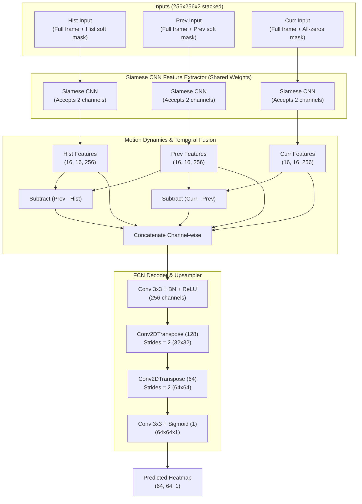

# Fully Convolutional Context-Preserving Tracker with Multi-Channel Masking (TargetTracker)

This directory contains the **Fully Convolutional Network (FCN) Siamese Tracker** (`tracker_model.py`).

By shifting from hard circular image cropping to a **multi-channel context-preserving input architecture**, this model retains the **entire peripheral background** across all frames. Rather than erasing pixels outside the target zone, the previous locations are fed to the model through a separate **attention mask channel**. 

This allows the network to learn rich **optical flow, translational motion, and camera ego-motion** cues from the background while maintaining precise focus on the target.

---

## 📐 Architecture Design

The tracker inputs three temporal branches. Each branch receives a 2-channel input (Channel 0 = Grayscale Image, Channel 1 = Attention Mask) of size $256 \times 256 \times 2$. A shared Siamese CNN backbone processes all three branches before temporal-fusion and spatial decoding.



---

## 🛠️ Key Architectural Paradigms

### 1. Multi-Channel Siamese Feature Extraction
Unlike traditional trackers that feed single-channel images, `TargetTracker`'s Siamese CNN takes **2-channel inputs**:
* **Channel 0**: The full, unmasked grayscale image. This preserves all context, allowing low-level and high-level filters to track global background movement.
* **Channel 1**: An attention mask pinpointing the target location in historical and previous frames. For the search frame (`curr`), this mask channel is filled with **zeros** since the target position is unknown.

### 2. Flexible Masking Strategies
To prevent artificial high-frequency edges (which binary circular masks suffer from and can confuse CNN filters), the model provides helpers for two types of attention masking:
* **Circular Mask (`generate_circular_mask`)**: Hard-edge binary circle (1.0 inside, 0.0 outside) representing a local search region.
* **Gaussian Soft Mask (`generate_gaussian_mask`)**: Smooth Gaussian heatmap with tunable standard deviation ($\sigma$). This smoothly guides the model's focus to the region of interest without creating harsh artificial borders.

### 3. Separation of Concerns (Dataset Generation)
Dataset generation logic is fully decoupled from the model script, leaving `tracker_model.py` entirely focused on model definition, custom loss functions, and high-performance training loops.

---

## 🏋️ Custom Spatial Loss Functions
The model fully registers and supports custom loss functions tailored for spatial heatmap regression:
1. **`dice_bce`**: Combines Dice Loss (structural overlap) with Binary Cross Entropy (pixel-wise convergence). Excellent for handling class imbalance.
2. **`focal`**: Sigmoid Focal Loss, designed specifically to focus gradients on hard, active target pixels while suppressing easy background zeros.

---

## 🚀 Execution & Training Guide

### 🏋️ Train the FCN Model
To train the model, ensure your external dataset generator outputs `.pkl` batches containing:
- **`inputs`**: List of 3 numpy arrays, each of shape `(batch_size, 256, 256, 2)` (stacked image and mask).
- **`targets`**: A numpy array of shape `(batch_size, 64, 64, 1)` (Gaussian target heatmap).

Run training using:
```bash
python3 training/tracker/tracker_ver3/tracker_model.py train \
    --dataset_dir /path/to/2channel_dataset \
    --lr 0.001 \
    --num_of_epochs 100 \
    --loss dice_bce \
    --output model_tracker.keras
```
