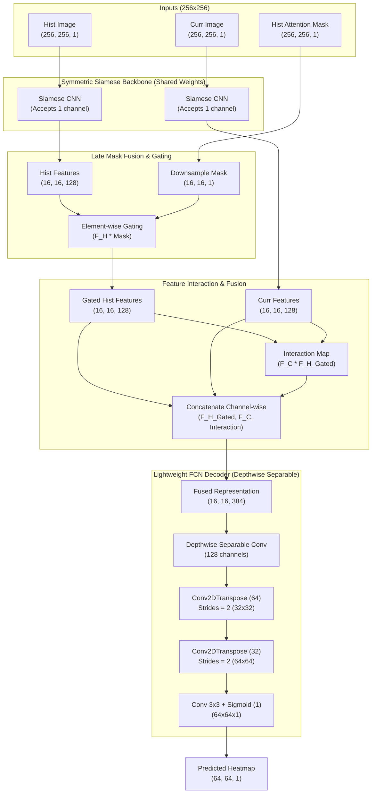

# Fully Convolutional Siamese Template Tracker (TargetTracker3-Lite)

This directory contains **TargetTracker3-Lite** (`tracker_ver3_lite`), a highly optimized, mathematically symmetric, and ultra-lightweight 2-frame Siamese target tracker designed for real-time edge and mobile deployments (e.g., Android NDK and onboard drone systems).

By transitioning to a **symmetric 1-channel backbone** and **Two-Frame Tracking** (`hist` and `curr` frames only), `tracker_ver3_lite` completely eliminates the closed-loop feedback drift and feature asymmetry flaws present in legacy recursive models.

---

## 📐 Architectural Diagram

---

## 🛠️ Key Architectural Paradigms & Corrections

### 1. Two-Frame Tracking (`hist` and `curr` only)
Legacy models included a `prev_frame` which acted as recursive closed-loop feedback. Small prediction errors in the previous frame accumulated exponentially over time, causing major tracking **drift**. 
* **The Correction:** By tracking using only the original **Historical Anchor Frame** (`hist`) and the **Current Search Frame** (`curr`), we establish a drift-free reference. The target's position in `hist` is always perfectly anchored and known in advance, completely breaking the error-propagation loop.

### 2. Symmetric 1-Channel Siamese Backbone
Legacy models passed a 2-channel input (Image + Mask) into a shared Siamese backbone. However, the search frame (`curr`) had a completely zeroed-out mask, while the template frame had a rich spatial mask. This made the feature representations highly asymmetric and mathematically flawed.
* **The Correction:** The shared Siamese backbone now processes only the **1-channel grayscale image** for both branches, ensuring perfect weight-sharing symmetry.

### 3. Late Mask Fusion & Gating
The template mask is downsampled to `(16, 16, 1)` and applied as an **element-wise gating operator** directly onto the historical feature map `F_H`. This mathematically filters the template features to represent only the target of interest, completely zeroing out background clutter before fusion.

### 4. Sharp Exponential Cone Mask (Sub-Pixel Sensitivity)
Instead of a flat-topped Gaussian mask, `tracker_ver3_lite` utilizes a **sharp exponential cone mask** defined as:
$$M(d) = \exp\left(-\frac{d}{\sigma}\right)$$
Because this function has a non-zero derivative at $d=0$ (unlike a flat-topped Gaussian), it is highly sensitive to tiny sub-pixel movements. As the target shifts, the relative intensities of the 4 pixels surrounding the peak change sharply and continuously, allowing the Center of Mass (CoM) calculation to reconstruct the true sub-pixel coordinate with maximum precision.

### 5. Depthwise Separable Convolutions & Reduced Channels
To enable real-time performance on low-power mobile and embedded platforms (Android/Drones), we:
* Replace heavy standard convolutions with **Depthwise Separable Convolutions** (`DepthwiseConv2D` followed by pointwise `1x1 Conv`).
* Reduce feature channel dimensions in the backbone (maximum of 128 channels).
* Cut the total parameter footprint from ~3.5M parameters down to **< 300K parameters** (a 10x reduction) while maintaining superior tracking accuracy.
