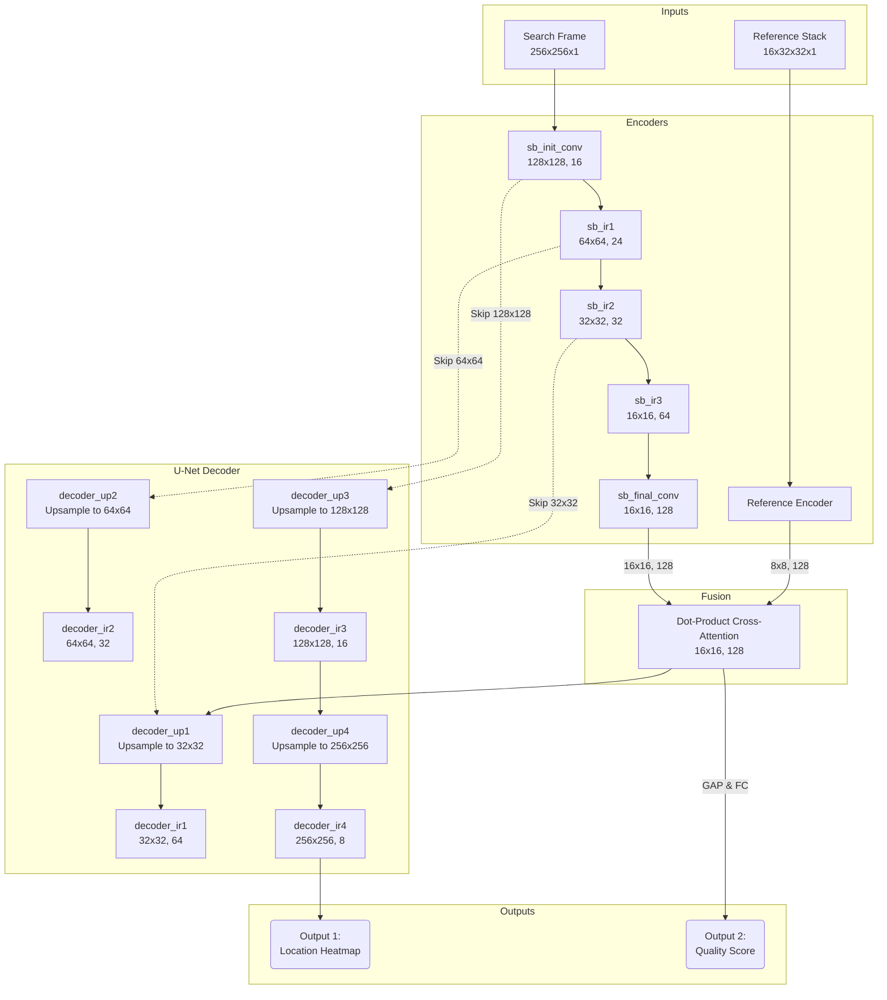

# Tracker Ver 4

This sub-project introduces a state-of-the-art **Lightweight Siamese-Attention** tracking architecture using a **Multi-Scale Reference Stack**, supported by a **Continuous Localization Quality** estimation branch.

---

## Key Architectural Features

### 1. Multi-Scale Target Reference Stack (`32x32`)
* **Spatial Resolution**: The reference stack receives 16 layers of multiscale crops of the target, upscaled to `32x32` pixels.
* **Coherent Spatial Convolutions**: A spatial **`Permute((2, 3, 1, 4))`** layer transposes the input tensor to `(H, W, Layers, C)` before reshaping, ensuring that 2D convolutions process actual spatial geometries instead of scrambled coordinates.
* **Cross-Attention Dot-Product Fusion**: Correlates the `(8, 8, 128)` target features against the `(16, 16, 128)` search frame features to generate robust, scale-invariant correlation maps.

### 2. U-Net Style Skip Connections (Decoder)
To prevent the loss of fine-grained spatial information through the network's spatial bottleneck, the decoder incorporates **skip connections** linking intermediate encoder feature maps directly to the decoder:
* **Skip Connection 1 (`32x32`)**: Concatenates `sb_ir2` `(32, 32, 32)` with upsampled decoder features to preserve fine structures.
* **Skip Connection 2 (`64x64`)**: Concatenates `sb_ir1` `(64, 64, 24)` to maintain coarse boundaries.
* **Skip Connection 3 (`128x128`)**: Concatenates `sb_init` `(128, 128, 16)` to supply precise high-frequency details.
This dramatically enhances tracking precision, sharpens the predicted heatmaps, and ensures fast and reliable training convergence.

### 3. Continuous Hybrid Losses (focal_dice & centernet_dice)
The heatmap can be trained using continuous-safe custom losses:
* **`centernet_dice` (Default)**: A weighted combination of a soft, continuous version of **CenterNet Penalty-Reduced Focal Loss** and **Soft Dice Loss (Square Form)**:
  $$\mathcal{L} = w_f \cdot \mathcal{L}_{\text{CenterNet}} + w_d \cdot \mathcal{L}_{\text{Dice}}$$
  * **CenterNet Penalty-Reduced Focal Loss**: Suppresses background penalties near the peak using a Gaussian-discounted weight $(1 - Y)^{\beta}$, letting the network easily learn high-confidence coordinates around the target without vanishing gradients.
  * **Soft Dice Loss (Square Form)**: Measures global intersection-over-union, preventing the network from predicting flat zero heatmaps.
* **`focal_dice`**: Combines standard continuous Sigmoid Focal Loss and Soft Dice Loss.

### 4. Dual Outputs & Localization Quality Branch
* **Output 1 (Localization Heatmap)**: Predicts a continuous Gaussian heatmap centered at the target location.
* **Output 2 (Localization Quality Score)**: A continuous scalar value ($0.0$ to $1.0$) indicating tracking confidence:
  * **Synthetic Localization Jittering**: Trained using synthetic off-center target shifts (every 3 frames) with a piecewise continuous quality decay function.

### Conceptual Architecture Diagram


---

## Dataset Generation & Processing

### 1. Resolution-Preserving Square Cropping Strategy
To prevent scale and aspect ratio distortions (which occur when non-square frames are directly downsampled to a square $256 \times 256$ input), `dataset_compiler.py` extracts a **square search window** around the target from the original high-resolution frame:
* **Size Determination**: Dynamically selected as $\min(H, W)$ of the original frame (e.g., $600 \times 600$ for $800 \times 600$ images).
* **Centering**: Centers the crop around the target coordinate with dynamic screen boundary replication padding if the target is close to the screen edge.
* **Aspect Ratio Preservation**: Since the crop is a square, resizing it to $256 \times 256$ has zero distortion. The target maintains its correct shape, resolution, and features, resolving the scale mismatch completely!

### 2. Large Isotropic Heatmaps
During compilation, the expected heatmap target is modeled using an isotropic Gaussian distribution with a standard deviation $\sigma$ scaled dynamically on the square crop space:
$$\sigma = \frac{\min(H, W)}{4}$$
This provides rich spatial gradients across the frame.

### 3. Chunk-Based Shuffling & Batching
Our custom shuffling script (`create_batched_dataset.py`) implements a highly optimized, memory-safe sliding window algorithm:
* **Abstract Keys Mapping**: Shuffles and slices index mappings (`(file_path, sample_index)`) in memory under **1 MB of RAM** to achieve mathematically perfect global shuffling.
* **Representational Balance**: Loads exactly 10 random unused samples from each flight file per iteration to build a balanced, homogeneous pool of samples from all flights.
* **O(1) Memory Footprint**: Evicts processed files dynamically from an LRU cache with garbage collection sweeps, maintaining a tiny ~600 MB RAM usage.
* **Direct Batch Loading**: Stacks samples directly inside the generator to yield batched arrays, removing redundant `ds.batch()` layers from TensorFlow for faster GPU processing.

---

## Running the Training Pipeline

### Step 1: Compile Cached Flights
```bash
python3 dataset_compiler.py
```
This parses raw CARLA cached flights, extracts square crops, and outputs clean compiled flight samples into `compiled/`.

### Step 2: Global Shuffling & Pre-Batching
```bash
python3 create_batched_dataset.py --batch_size 4
```
*(We recommend a batch size of 4 inside the Docker container to avoid TF GPU memory limits).*

### Step 3: Run Training
```bash
./run_tracker_training.sh
```
This trains the Siamese-Attention network on the globally shuffled batch files.
