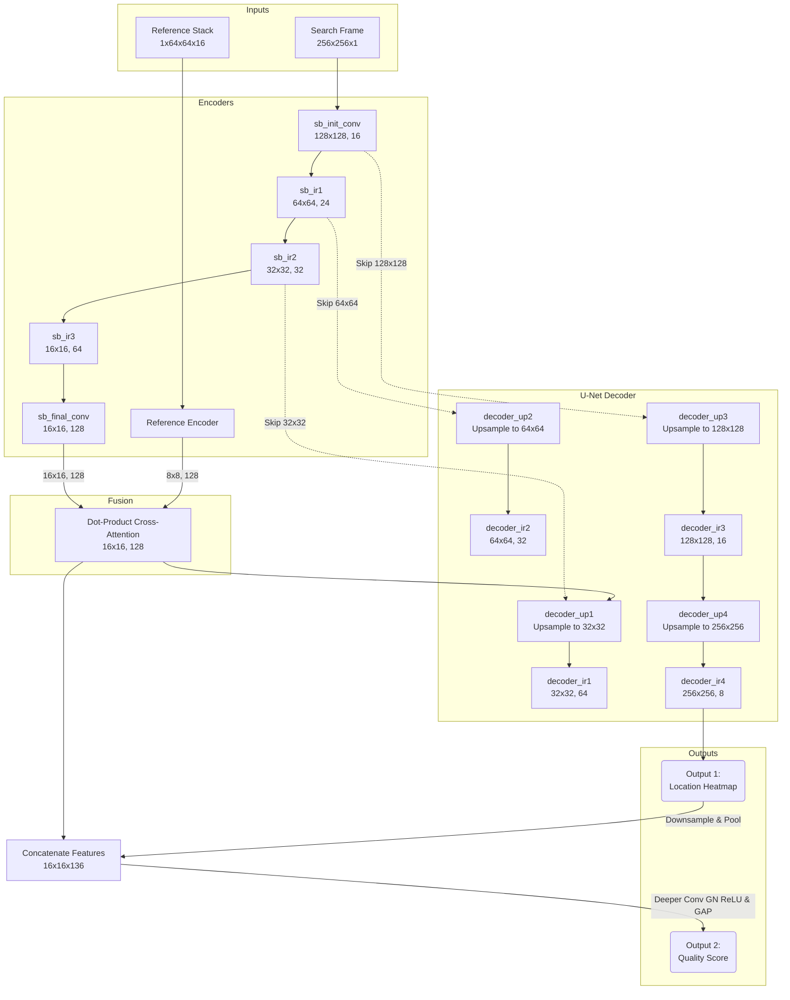

# Tracker Ver 4

This sub-project introduces a state-of-the-art **Lightweight Siamese-Attention** tracking architecture using a **Multi-Scale Reference Stack**, supported by a **Continuous Localization Quality** estimation branch.

### Hardware & Operating Context Focus
* **Edge Hardware Constraints**: The architecture is designed to run efficiently on low-resource single-board computers (SBCs) such as the **Rockchip Radxa Zero 3W** or **Raspberry Pi**, balancing tracking precision with low-latency execution (aiming for 20-30 FPS).
* **Static Target Tracking**: Designed specifically to track static objects/landmarks on the terrain **without any predefined or known pattern**.
* **3D Geometry Invariance**: Robustly maintains target lock as the apparent target geometry undergoes significant transformations due to camera approach/zoom (scale/FOV changes), translation (sideways drift), and 3D rotations (Pitch, Roll, and Yaw).

---

## Architectural Configuration (`model.conf`)

To facilitate rapid optimization and hardware-specific tuning, the network architecture is fully parameterized via a local config file [model.conf](file:///home/elazarkin/work/projects/ksg/smart_rahfan/training/tracker/tracker_ver4/model.conf).

### Configuration Options
* **`reference_backbone` & `search_backbone`**:
  * `mini_mnv2` (Recommended default for stack): Custom shallow MobileNetV2 with capped channel widths optimized for small inputs.
  * `mnv2_nano` (Recommended default for search): Ultra-lightweight MobileNetV2 with low FLOP footprint.
  * `mnv1`: Standard MobileNetV1.
  * `mnv2`: Full MobileNetV2.
  * `yolo5`: CSPDarknet-style backbone.
  * `custom_legacy`: The original tracker_ver4 backbones.
* **`width_multiplier`**: Capping or scaling factor for backbone channel widths (default: `0.5`).
* **`attention_mechanism`**:
  * `depthwise_corr` (Recommended default): SiamFC-style depthwise cross-correlation. Zero learnable parameters, highly parallelizable, and extremely fast on CPUs.
  * `dot_cross`: Standard single-head dot-product cross-attention.
  * `linear_cross`: Linearized cross-attention with $O(N)$ spatial complexity.
  * `multi_head_cross`: Multi-head cross-attention.
* **`decoder_type`**:
  * `fpn_add` (Recommended default): FPN-style decoder with skip-add connections, minimizing RAM bandwidth overhead.
  * `unet`: Classic U-Net decoder with skip-concatenations.
  * `pixel_shuffle`: Sub-pixel convolution decoder.
  * `light_naive`: Fast transposed convs without skip connections.

---

## Key Architectural Features

### 1. Multi-Scale Target Reference Stack (`64x64`)
* **Spatial Resolution**: The reference stack receives 16 layers of multiscale crops of the target, compiled at `64x64` pixels.
* **Direct Channel Layout**: The input shape is `(1, 64, 64, 16)` where the 16 layers are packed as channels. It is reshaped to `(64, 64, 16)` dynamically in the encoders, avoiding legacy permute operations.
* **Cross-Attention Dot-Product Fusion**: Correlates the `(8, 8, 128)` target features against the `(16, 16, 128)` search frame features to generate robust, scale-invariant correlation maps.

### 2. U-Net Style Skip Connections (Decoder)
To prevent the loss of fine-grained spatial information through the network's spatial bottleneck, the decoder incorporates **skip connections** linking intermediate encoder feature maps directly to the decoder:
* **Skip Connection 1 (`32x32`)**: Concatenates `sb_ir2` `(32, 32, 32)` with upsampled decoder features to preserve fine structures.
* **Skip Connection 2 (`64x64`)**: Concatenates `sb_ir1` `(64, 64, 24)` to maintain coarse boundaries.
* **Skip Connection 3 (`128x128`)**: Concatenates `sb_init` `(128, 128, 16)` to supply precise high-frequency details.
This dramatically enhances tracking precision, sharpens the predicted heatmaps, and ensures fast and reliable training convergence.

### 3. Continuous Hybrid & DBSZ Losses (with Background Suppression)
The heatmap can be trained using continuous-safe custom losses or Dynamic Balanced Semantic Zone (DBSZ) losses:
* **DBSZ Losses (`dbsz_hard`, `dbsz_soft`, `dbsz_relu`)**: These losses dynamically divide the heatmap into high-confidence peak zones and low-confidence background zones, balancing the training gradients. The `dbsz_relu` loss features a configurable `--dbsz_border` parameter (default: `0.35`) defining the zone boundaries continuously to eliminate gradient-free transition bands.
* **Background Suppression Weight (`--c_bg`)**: To suppress real-world camera noise and false-positive activations in the background (black regions of the heatmap), a controlled weight multiplier $C_{bg}$ (default: `3.0`) is applied directly to the background loss component:
  $$\mathcal{L}_{\text{DBSZ}} = \mathcal{L}_{\text{high}} + C_{bg} \cdot \mathcal{L}_{\text{low}}$$
  Setting $C_{bg}$ to `3.0` penalizes background activations 3 times harder, forcing the network to keep the background flat and dark.
* **`centernet_dice` (Default)**: A weighted combination of a soft, continuous version of **CenterNet Penalty-Reduced Focal Loss** and **Soft Dice Loss (Square Form)**:
  $$\mathcal{L} = w_f \cdot \mathcal{L}_{\text{CenterNet}} + w_d \cdot \mathcal{L}_{\text{Dice}}$$
* **`focal_dice`**: Combines standard continuous Sigmoid Focal Loss and Soft Dice Loss.

### 4. Heatmap-Guided Quality Score Branch
* **Output 1 (Localization Heatmap)**: Predicts a continuous Gaussian heatmap centered at the target location. Updated from a saturating `sigmoid` function to a non-saturating **ReLU Activation + Max-Only Normalization** layer:
  $$\hat{Z} = \frac{\text{ReLU}(Z)}{\max(\text{ReLU}(Z)) + 10^{-7}}$$
  This preserves the exact relative linear shape/geometry of the predicted Gaussian peak (preventing logits like 6 and 20 from flattening to 1.0), yielding high sub-pixel centroid accuracy during local Center of Mass calculations.
* **Output 2 (Localization Quality Score)**: A continuous scalar value ($0.0$ to $1.0$) indicating tracking confidence.
* **Heatmap-Guided Design**: Instead of classifying quality solely from intermediate features, the predicted `output_heatmap` is downsampled to `(16, 16, 8)` and concatenated directly with the `fused_features` `(16, 16, 128)`. This lets the quality branch directly analyze the confidence, structure, and clarity of the predicted localization peak!
* **Deeper CNN Architecture**: Uses 2 layers of 2D convolutions with Group Normalization and ReLU activations to preserve spatial layout before applying Global Average Pooling (GAP) and Dense layers, yielding high-capacity confidence classification.

### Conceptual Architecture Diagram


---

## Dataset Generation & Processing

### 1. Resolution-Preserving Square Cropping Strategy
To prevent scale and aspect ratio distortions (which occur when non-square frames are directly downsampled to a square $256 \times 256$ input), `dataset_compiler.py` extracts a **square search window** around the target from the original high-resolution frame:
* **Size Determination**: Dynamically selected as $\min(H, W)$ of the original frame (e.g., $600 \times 600$ for $800 \times 600$ images).
* **Centering**: Centers the crop around the target coordinate with dynamic screen boundary replication padding if the target is close to the screen edge.
* **Aspect Ratio Preservation**: Since the crop is a square, resizing it to $256 \times 256$ has zero distortion. The target maintains its correct shape, resolution, and features, resolving the scale mismatch completely!

### 2. Large Isotropic Heatmaps
During compilation, the expected heatmap target is modeled using an isotropic Gaussian distribution with a standard deviation $\sigma$ scaled dynamically on the square crop space:
$$\sigma = \frac{\min(H, W)}{4}$$
This provides rich spatial gradients across the frame.

### 3. Relaxed Continuous Quality Score Decay
To resolve conflicting gradients between the heatmap regression branch and the localization quality branch, we replaced the previous aggressive exponential decay (which penalised slightly off-center but still perfectly trackable targets) with a **relaxed piecewise continuous quality score** based on the target offset $d$ (in pixels on the square search window):
* **For small offsets ($d \le 4.0$ pixels)**: Uses a very gradual linear decay:
  $$\text{Quality}(d) = 1.0 - d \cdot 0.02$$
* **For larger offsets ($d > 4.0$ pixels)**: Decays smoothly using a highly relaxed exponential model:
  $$\text{Quality}(d) = 0.9 \cdot e^{-\frac{d-4.0}{48.0}}$$

This mathematical relaxation guarantees that targets remain trackable ($\text{Quality} \ge 0.70$) up to offset shifts of $15$-$20$ pixels, aligning perfectly with the heatmap's peak prediction capabilities and preventing gradient pollution.

### 4. Single-File HDF5 Compilation (`dataset.h5`)
To optimize disk storage and read speeds, `dataset_compiler.py` compiles all flights progressively into a single, unified HDF5 dataset file (`dataset.h5`) under `dataset_generator/compiled/`. This avoids creating thousands of small pickled files, reducing disk fragmentation and I/O latency.

### 5. Dynamic In-Memory RAM Caching & Shuffling
The dataloader dynamically loads `dataset.h5` and performs:
* **Memory Safety**: Checks system memory availability using `psutil` before caching the dataset in RAM. If RAM is sufficient, the entire dataset is loaded to memory to avoid CPU pickling/unpickling bottlenecks.
* **Stage-Specific Filtering**: Filters only positive target samples in Stage 1 (`heatmap_only`), and dynamically balances classes 50-50 (positive vs negative/background) in Stage 2 (`quality_only`).
* **Deterministic Shuffling**: Shuffles sample indices deterministically with a fixed seed (`42`) before splitting into training and validation folds (using `--val_split`).

---

## Decoupled Two-Stage Training Pipeline

To prevent conflicting gradients from the Quality classifier branch from polluting the shared spatial encoders, the training is conducted in two decoupled stages using the `--train_mode` CLI flag:

### Stage 1: Heatmap Training (`--train_mode heatmap_only`)
- **Action**: Freezes the Quality branch layers.
- **Dataset**: Loads target data from `dataset.h5`, filtering positive samples only.
- **Outcome**: The encoders and decoder learn to extract pristine, noise-immune spatial features and predict razor-sharp heatmaps.

### Stage 2: Quality Training (`--train_mode quality_only`)
- **Action**: **Freezes the shared encoders and heatmap decoder**. Only the quality branch layers are trainable.
- **Dataset**: Loads target data from `dataset.h5`, balancing positive and negative samples 50-50.
- **Outcome**: The Quality branch learns robust tracking confidence boundaries based on static, pre-trained spatial features.

---

## Running the Training Pipeline

### Step 1: Compile Cached Flights to HDF5
```bash
python3 dataset_generator/dataset_compiler.py
```
Parses raw CARLA cached flights, extracts square crops, resizes templates to 64x64, calculates relaxed continuous quality scores, and compiles all flights into `dataset_generator/compiled/dataset.h5`.

### Step 2: Run Stage 1 (Heatmap Only)
Train the spatial feature encoders and heatmap decoder. You can specify `--val_split` for evaluation splitting:
```bash
python3 tracker_model.py train \
    --dataset_dir dataset_generator/compiled \
    --train_mode heatmap_only \
    --loss_heatmap dbsz_relu \
    --dbsz_border 0.35 \
    --val_split 0.1 \
    --output outputs/tracker.keras
```

### Step 3: Run Stage 2 (Quality Only)
Loads the pre-trained weights from Stage 1, freezes them, and trains only the Quality classification branch:
```bash
python3 tracker_model.py train \
    --dataset_dir dataset_generator/compiled \
    --train_mode quality_only \
    --init_keras_file outputs/tracker.keras \
    --val_split 0.1 \
    --output outputs/tracker.keras
```

---

## Android Client Implementation

The Android application is located in `android/` and features a high-performance, real-time Siamese tracking client.

### Architectural Highlights
1. **Producer-Consumer (Double-Buffering) Engine**:
   - CameraX frame analysis runs asynchronously as a Producer. It writes raw Y-plane bytes to a shared buffer and instantly closes the image proxy, ensuring the camera stream never blocks (maintains 30+ FPS UI smoothness).
   - A dedicated background `TrackerWorkerThread` (Consumer) waits for new frames. It pops the freshest frame from the buffer, skipping older unused frames to prevent lag accumulation (guarantees zero-lag real-time inference).
2. **JNI C++ Square Cropping & Interpolation**:
   - Standard camera frames are rectangular (e.g. 16:9). To avoid scale and aspect ratio distortions, the JNI C++ layer extracts a local square crop of size $\min(W, H)$ centered on the **previous tracked coordinate**.
   - The crop is resized to $256 \times 256$ using high-quality bilinear interpolation and dynamic boundary replication padding.
3. **Local Refined Argmax Centroiding**:
   - In JNI C++, we locate the absolute peak in the predicted $256 \times 256$ heatmap (immune to far-away background noise). We then compute the sub-pixel Center of Mass strictly within a local $5 \times 5$ window centered around the peak.
4. **Dynamic Lock Coloring & Diagnostics**:
   - The target circle remains active at all times. It is colored **GREEN** when the quality score is $\ge 0.20$, and **RED** when the quality falls below $0.20$ (indicating a weak lock).
   - Shows live multi-channel diagnostic views: predicted Jet heatmap, locked target reference crop, and the current search window.

> [!TIP]
> **TODO: Active Search Recovery Mode**
> When the quality score falls below the threshold (circle turns RED), the client should ideally trigger an active search recovery sequence (e.g. expanding the square search crop size or scanning the frame grid). This is documented as a future enhancement both here and inside `FrameStreamActivity.java`.
