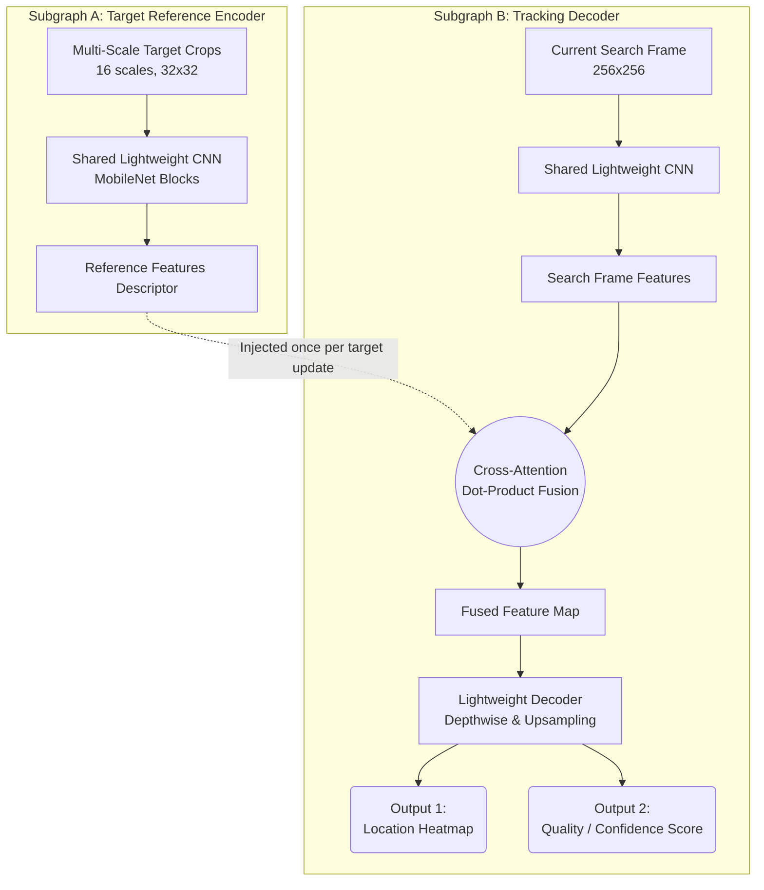

# Tracker Ver 4

This sub-project introduces a state-of-the-art **Lightweight Siamese-Attention** tracking architecture using a **Multi-Scale Reference Stack**, supported by a **Continuous Localization Quality** estimation branch.

---

## Key Architectural Features

### 1. Multi-Scale Target Reference Stack (`32x32`)
* **Spatial Resolution**: The reference stack receives 16 layers of multiscale crops of the target, upscaled to `32x32` pixels.
* **Coherent Spatial Convolutions**: A spatial **`Permute((2, 3, 1, 4))`** layer transposes the input tensor to `(H, W, Layers, C)` before reshaping, ensuring that 2D convolutions process actual spatial geometries instead of scrambled coordinates.
* **Cross-Attention Dot-Product Fusion**: Correlates the `(8, 8, 128)` target features against the `(16, 16, 128)` search frame features to generate robust, scale-invariant correlation maps.

### 2. Dual Outputs & Localization Quality Branch
* **Output 1 (Localization Heatmap)**: Predicts a continuous Gaussian heatmap centered at the target location.
* **Output 2 (Localization Quality Score)**: A continuous scalar value ($0.0$ to $1.0$) indicating tracking confidence:
  * **Synthetic Localization Jittering**: Trained using synthetic off-center target shifts (every 3 frames) with a piecewise continuous quality decay function:
    * $d \le 2$ pixels: $q \ge 0.9$ (High lock confidence)
    * $d \le 4$ pixels: $q \ge 0.7$ (Minor drift warning)
    * $d \le 8$ pixels: $q \ge 0.4$ (Severe drift warning)
    * $d > 8$ pixels: $q \to 0.0$ (Failure / Target Lost)
    * **Out of Bounds**: $q = 0.0$ (Lock lost completely)

### Conceptual Architecture Diagram


---

## Dataset Generation & Processing

### 1. Large Isotropic Heatmaps
During compilation, the expected heatmap target is modeled using an isotropic Gaussian distribution with a standard deviation $\sigma$ scaled dynamically to a quarter of the minimum image dimension:
$$\sigma = \frac{\min(H, W)}{4}$$
This provides rich spatial gradients across the frame and completely avoids vanishing gradients / zero-prediction local minima during training.

### 2. Chunk-Based Shuffling & Batching
Our custom shuffling script (`create_batched_dataset.py`) implements a highly optimized, memory-safe sliding window algorithm:
* **Abstract Keys Mapping**: Shuffles and slices index mappings (`(file_path, sample_index)`) in memory under **1 MB of RAM** to achieve mathematically perfect global shuffling.
* **Representational Balance**: Loads exactly 10 random unused samples from each flight file per iteration to build a balanced, homogeneous pool of samples from all flights.
* **O(1) Memory Footprint**: Evicts processed files dynamically from an LRU cache with garbage collection sweeps, maintaining a tiny ~600 MB RAM usage.
* **Direct Batch Loading**: Stacks samples directly inside the generator to yield batched arrays, removing redundant `ds.batch()` layers from TensorFlow for faster GPU processing.

---

## Running the Training Pipeline

### Step 1: Compile Cached Flights
```bash
python3 dataset_compiler.py
```
This parses raw CARLA cached flights and outputs upscaled crops and shifted Jittered targets into `compiled/`.

### Step 2: Global Shuffling & Pre-Batching
```bash
python3 create_batched_dataset.py --batch_size 4
```
*(We recommend a batch size of 4 inside the Docker container to avoid TF GPU memory limits).*

### Step 3: Run Training
```bash
./run_tracker_training.sh
```
This trains the Siamese-Attention network on the globally shuffled batch files.
